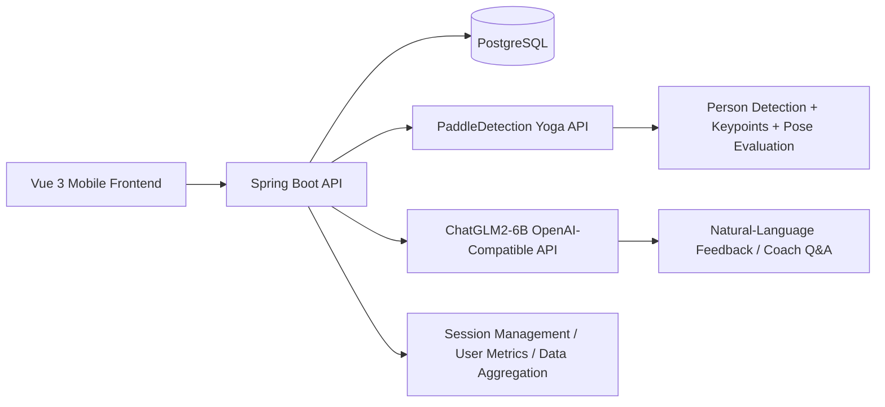

# YogaForge AI: Intelligent Yoga Coach System

<div align="center">

**A mobile-first intelligent yoga coach robot system that integrates computer vision, large language models, and backend services to deliver pose recognition, scoring, corrective guidance, and training analytics in a closed loop.**


</div>

---

## ✨ Project Positioning

This project focuses on the end-to-end design and development of an **intelligent yoga coach robot system**. The core goal is to combine **human pose recognition, quality scoring, corrective suggestions, training statistics, and natural-language interaction** into a service-oriented, scalable training platform.

The system is built around the following capabilities:

- **Computer Vision Inference**: Built on Baidu PaddlePaddle + PaddleDetection for person detection, keypoint estimation, pose evaluation, and quality scoring.
- **LLM-Enhanced Interaction**: Integrates ChatGLM2-6B online APIs, with support for tuning workflows, to provide more natural feedback and explanation.
- **Backend Service Architecture**: Uses Spring Boot + PostgreSQL for API orchestration, session lifecycle, data aggregation, and cross-service calls.
- **Mobile Training Experience**: Uses Vue 3 to handle camera sampling, training interactions, result visualization, and analytics presentation.
- **Cross-Language Integration**: Connects TypeScript frontend, Java backend, and Python model services into one coherent pipeline.

> This is a multi-module full-stack system for intelligent yoga training, not a single-page demo or a standalone model script.

---

## 🚀 Highlights

### 1) Real Training-Oriented Yoga Coach Flow
The system does more than “recognize a pose.” It follows the full training workflow:

- Open camera
- Capture video frames
- Detect person and keypoints
- Match against pose templates
- Compute quality score
- Generate corrective suggestions
- Aggregate duration, calories, and session metrics

### 2) Paddle-Based Vision Capability as a Service
Built with **PaddleDetection + TinyPose + PicoDet**, and packaged as APIs for both frontend and Java backend:

- Basic keypoint inference
- Yoga pose recognition
- Quality scoring
- Corrective text guidance
- Skeleton rendering output

### 3) CV + LLM Fusion
In addition to pose inference, the system integrates **ChatGLM2-6B** to provide coaching Q&A, training explanation, and assistant-style feedback.

### 4) Full Backend Orchestration
The Java backend handles session orchestration, persistence, user metrics aggregation, and model-service forwarding:

- Extensible API architecture
- Maintainable data model
- Clear service boundaries
- Cross-language interoperability

### 5) Engineering-Ready Modular Split
The repository already follows clean boundaries:

- Frontend interaction layer: Vue 3
- Business API layer: Spring Boot
- Vision inference layer: PaddleDetection / Flask
- Language model layer: ChatGLM2-6B / FastAPI
- Data persistence layer: PostgreSQL

This structure is naturally ready for further evolution into **containerized deployment, service orchestration, concurrency optimization, and reliability hardening**.

---

## 🧠 Resume / Presentation Aligned Summary

This project can be summarized as:

- **Designed and developed an intelligent yoga coach robot system end-to-end**, integrating computer vision, LLM capability, and backend services; implemented yoga pose recognition/scoring based on PaddlePaddle and delivered corrective guidance + training analytics to mobile clients.
- **Implemented Paddle model API encapsulation and service deployment**, integrated ChatGLM2-6B via online interfaces, and retained P-Tuning workflow support.
- **Designed PostgreSQL schema and backend architecture**, enabled TypeScript-Java-Python cross-language integration, and established a stable foundation for reliability and scalability improvements.

> For GitHub portfolio, interviews, or project defense, this repository is best presented as an “intelligent yoga coach system,” rather than a companion/pet feature project.

---

## 🏗️ System Architecture



### Training Closed Loop

```text
User enters workout page
  ↓
Camera captures video frames
  ↓
Backend / vision service runs pose inference
  ↓
Returns pose result, quality score, corrective suggestions
  ↓
Session ends and aggregates duration / calories / stats
  ↓
User reviews analysis and can continue coach chat interaction
```

---

## 🧰 Tech Stack

| Layer | Technologies |
|---|---|
| Frontend | Vue 3, TypeScript, Vite, Vue Router, Pinia, Axios, SCSS, Tailwind CSS, Naive UI |
| Backend | Java 17, Spring Boot 3, Spring Security, Spring Data JPA, JWT, Lombok |
| Database | PostgreSQL |
| Vision AI | PaddleDetection, PaddlePaddle, OpenCV, Flask |
| LLM | ChatGLM2-6B, FastAPI, OpenAI-Compatible API |
| Cross-Language | TypeScript + Java + Python |

---

## 📱 Frontend Overview

The frontend lives in [frontend](./frontend) and handles training interaction and visualization.

### Key Pages

- `AuthPage`: Sign-in / Sign-up
- `WorkoutPage`: Device connection, camera preview, training loop, skeleton overlay
- `DataPage`: Daily metrics, monthly check-in calendar, completion stats
- `CaloriesDetailPage`: Calorie details
- `ExerciseDurationPage`: Duration details
- `ProfilePage`: User profile + aggregate training stats

### Implemented Training-Side Capabilities

- Scan and mock-connect training devices
- Open camera and sample frames periodically
- Draw skeleton overlay with recognition output
- Send periodic recognition requests to backend/model services
- Report duration and calories at session end

### Frontend Engineering Traits

- Unified Axios API wrapper
- Automatic JWT token injection
- Mobile-style interaction design
- Linked training flow and analytics view

---

## 🔐 Spring Boot Backend

Backend path: [backend/backend/springboot-server](./backend/backend/springboot-server)

It acts as the central hub for **business orchestration + data aggregation + cross-service forwarding**.

### Implemented Responsibilities

- User registration, login, JWT auth
- Current user profile query/update
- Daily and cumulative training metric aggregation
- Yoga session lifecycle: start / frame / stop
- Manual metric submission
- Vision service client encapsulation
- LLM service client encapsulation
- PostgreSQL persistence

### Core APIs

#### Auth & User
- `POST /api/auth/register`
- `POST /api/auth/login`
- `GET /api/users/me`
- `PATCH /api/users/me`
- `GET /api/users/me/metrics`
- `GET /api/user/today-data`

#### Workout & Metrics
- `POST /api/yoga/session/start`
- `POST /api/yoga/session/frame`
- `POST /api/yoga/session/stop`
- `GET /api/yoga/session/metrics`
- `POST /api/yoga/session/metrics-manual`

#### LLM Interaction
- `POST /api/chat`

### Backend Value

- Decouples frontend from model internals
- Centralizes auth rules and business logic
- Provides a stable integration point for cross-language services
- Leaves clear extension points for retries, timeout control, and production hardening

---

## 🧍 Vision Module: PaddleDetection Yoga API

Vision module path: [backend/backend/PaddleDetection](./backend/backend/PaddleDetection)

Custom service entry:

- [backend/backend/PaddleDetection/app/yoga_api_server.py](./backend/backend/PaddleDetection/app/yoga_api_server.py)

### Implemented Vision Pipeline

- **Person Detection**: PicoDet localizes main human target
- **Keypoint Estimation**: TinyPose predicts body keypoints
- **Template Matching**: Angle-feature pose template comparison
- **Quality Scoring**: Returns `qualityScore`
- **Corrective Guidance**: Returns `suggestions`
- **Visualization Rendering**: Returns skeleton-annotated image output

### External Endpoints

- `POST /infer`: basic keypoint inference
- `POST /pose/evaluate`: returns `recognized`, `templatePose`, `qualityScore`, `suggestions`
- `POST /pose/render`: returns skeleton-rendered output
- `GET /health`: health check

### Engineering Significance

This is not just “running an official model.” It includes:

- Paddle model encapsulation
- Scene-oriented API serviceization
- Template-based evaluation logic integration
- Corrective guidance generation pipeline
- Frontend-consumable response schema design

---

## 🤖 LLM Module: ChatGLM2-6B

LLM module path: [backend/backend/ChatGLM2-6B](./backend/backend/ChatGLM2-6B)

Integrated components:

- `openai_api.py`: OpenAI-compatible API adapter for ChatGLM2-6B
- `ptuning/`: P-Tuning v2 tuning-related scripts and structure
- Local model directory `models/chatglm2-6b`

### Role in This System

ChatGLM2-6B is used for **training explanation and conversational coaching**, not pose detection itself:

- Users can ask training-related questions in natural language
- Java backend calls model API via a unified interface
- Model API is standardized and reusable by multiple clients

### Integration Pattern

- Java backend calls `/v1/chat/completions`
- Frontend input is mapped to OpenAI-style `messages`
- Model output is wrapped and returned through business APIs

### Demonstrable Capabilities

- ChatGLM2-6B online API integration
- OpenAI-compatible serving adaptation
- P-Tuning pipeline retention
- Business-level integration with training scenarios

---

## 🗄️ PostgreSQL Data Design

Configuration and schema:

- [backend/backend/springboot-server/src/main/resources/application.yml](./backend/backend/springboot-server/src/main/resources/application.yml)
- [backend/backend/springboot-server/src/main/resources/schema.sql](./backend/backend/springboot-server/src/main/resources/schema.sql)

### Core Tables in Use

- `users`: user profile
- `exercise_sessions`: workout session records
- `user_metrics`: aggregated user workout metrics
- `devices` / `device_sessions`: device and session mapping
- Additional tables support extensible session/state management

### Data-Layer Value

- Persistent training records
- Daily and cumulative analytics foundation
- Extensible base for reports/rankings/profile insights
- Stable JPA entity mapping with backend domain model

---

## 🔄 Cross-Language Integration

This project is a typical multi-language architecture:

- **TypeScript / Vue**: mobile UX and visualization
- **Java / Spring Boot**: business API, auth, data, orchestration
- **Python / Flask / FastAPI**: vision inference and LLM serving

### Integration Flow

1. Frontend sends image/input
2. Java backend receives unified business request
3. Java forwards to Python vision service or LLM service
4. Python returns structured output
5. Java aggregates and returns final response
6. PostgreSQL stores session and metric data

This split demonstrates:

- Cross-language system integration
- Clear service boundary design
- API contract design
- Production-oriented model engineering

---

## 📁 Repository Structure

```text
yogaforge-ai/
├─ frontend/                                 # Vue 3 training app
│  ├─ src/
│  │  ├─ api/                                # Axios API wrapper
│  │  ├─ router/                             # Route configuration
│  │  ├─ stores/                             # State management
│  │  ├─ views/                              # Page views
│  │  └─ components/                         # Reusable components
│
├─ backend/
│  └─ backend/
│     ├─ springboot-server/                  # Java business backend
│     ├─ PaddleDetection/                    # Paddle vision + Yoga API
│     │  ├─ app/yoga_api_server.py           # Vision service entry
│     │  └─ Yoga-82/                         # Yoga-82 data and scripts
│     └─ ChatGLM2-6B/                        # ChatGLM2-6B serving adapter
│
└─ .env.example                              # Frontend env template
```

---

## 🚀 Quick Start

> Recommended order: **Vision Service → LLM Service → Java Backend → Frontend**.

### 1) Start Vision Service

```bash
cd backend/backend/PaddleDetection
python app/yoga_api_server.py
```

Default: `http://localhost:5001`

### 2) Start ChatGLM2-6B API

```bash
cd backend/backend/ChatGLM2-6B
python openai_api.py
```

Default endpoints:
- `GET /v1/models`
- `POST /v1/chat/completions`

### 3) Start Spring Boot Backend

```bash
cd backend/backend/springboot-server
mvn clean package
mvn spring-boot:run
```

### 4) Start Frontend

```bash
cd frontend
npm install
npm run dev
```

---

## ⚙️ Environment Recommendations

### Frontend
- Node.js 18+
- npm / pnpm

### Java Backend
- Java 17
- Maven 3.9+
- PostgreSQL

### Python Model Services
- Python 3.10+
- PaddlePaddle / OpenCV / Flask
- PyTorch / Transformers / FastAPI
- GPU environment recommended for high-throughput inference

---

## 📌 Key Implementation Files

### Vision
- [backend/backend/PaddleDetection/app/yoga_api_server.py](./backend/backend/PaddleDetection/app/yoga_api_server.py)
- [backend/backend/PaddleDetection/Yoga-82/yoga82_dataset.py](./backend/backend/PaddleDetection/Yoga-82/yoga82_dataset.py)
- [backend/backend/PaddleDetection/Yoga-82/train_yoga82_classifier.py](./backend/backend/PaddleDetection/Yoga-82/train_yoga82_classifier.py)

### Backend
- [backend/backend/springboot-server/src/main/java/com/myfitpet/yoga/YogaController.java](./backend/backend/springboot-server/src/main/java/com/myfitpet/yoga/YogaController.java)
- [backend/backend/springboot-server/src/main/java/com/myfitpet/yoga/TodayStatsController.java](./backend/backend/springboot-server/src/main/java/com/myfitpet/yoga/TodayStatsController.java)
- [backend/backend/springboot-server/src/main/java/com/myfitpet/pose/PoseModelClient.java](./backend/backend/springboot-server/src/main/java/com/myfitpet/pose/PoseModelClient.java)
- [backend/backend/springboot-server/src/main/java/com/myfitpet/chat/ChatModelClient.java](./backend/backend/springboot-server/src/main/java/com/myfitpet/chat/ChatModelClient.java)

### Frontend
- [frontend/src/views/WorkoutPage.vue](./frontend/src/views/WorkoutPage.vue)
- [frontend/src/views/DataPage.vue](./frontend/src/views/DataPage.vue)
- [frontend/src/views/ProfilePage.vue](./frontend/src/views/ProfilePage.vue)

### LLM
- [backend/backend/ChatGLM2-6B/openai_api.py](./backend/backend/ChatGLM2-6B/openai_api.py)
- [backend/backend/ChatGLM2-6B/ptuning](./backend/backend/ChatGLM2-6B/ptuning)

---

## 🧩 Engineering Notes

From the current codebase, the system already shows these engineering characteristics:

- Decoupled model services and business APIs
- Independently deployable frontend/backend/AI services
- PostgreSQL persistence with JPA mapping
- Unified backend API entrypoint
- Complete cross-language integration chain

### About Containerization

This repository **does not yet include project-level Dockerfile / docker-compose files**.
However, the service boundaries are already aligned with containerized deployment:

- Frontend container
- Spring Boot API container
- PaddleDetection vision service container
- ChatGLM2-6B model service container
- PostgreSQL container

So in presentations or future iterations, containerized orchestration is a natural next step.

### About Concurrency & Reliability

The current code has unified service clients and centralized business entrypoints, leaving good extension points for:

- Timeout control
- Retry policy
- Circuit breaking / degradation
- Concurrency scheduling
- Model-service load split

These are key paths from a “working prototype” to a “production-grade system.”

---

## 🌱 Future Roadmap

- Add more yoga pose templates and action categories
- Provide finer-grained training reports and stage-wise analytics
- Improve personalization of LLM coaching suggestions
- Add backend retry/timeout/asynchronous processing enhancements
- Add Dockerfile / compose for full containerized deployment
- Introduce caching, queueing, or gateway layer for higher concurrency resilience

---

## ❤️ Final Summary

What makes this project valuable is not a single page, but the complete integration:

- Turned **Paddle-based vision inference** into callable yoga evaluation APIs
- Integrated **ChatGLM2-6B** as online language capability
- Built a stable business backbone with **Spring Boot + PostgreSQL**
- Delivered training UX and analytics via **Vue 3 mobile frontend**
- Connected a full **TypeScript / Java / Python** cross-language workflow

> In one line: this is a full-stack AI system delivering end-to-end design and implementation for an intelligent yoga coach robot scenario.


# Large Files Notice (GitHub Upload)

To ensure the repository can be pushed to GitHub successfully, the following large files/directories are excluded from version control:

| Path | Type | Why It Is Not Uploaded | How to Obtain |
|---|---|---|---|
| `backend/backend/ChatGLM2-6B/models/` | LLM weights | Single files and total size are too large (far beyond GitHub limits) | Download ChatGLM2-6B weights from official model sources (recommended: HuggingFace or ModelScope) |
| `backend/backend/ChatGLM2-6B/ptuning/glm310/` | Local Python environment | Local environment folders are large and not reproducible | Recreate the virtual environment and install dependencies from `requirements.txt` |
| `backend/backend/PaddleDetection/Yoga-82/` | Training/inference dataset | Dataset is too large for source repository storage | Download from maintainer-provided package, Release assets, or team shared storage |
| `backend/backend/PaddleDetection/pretrained/` | Pretrained weights | Binary files are large | Download corresponding weights from official PaddleDetection model sources |
| `backend/backend/PaddleDetection/output/` | Training outputs | Generated artifacts should not be versioned | Generated automatically after local training |
| `backend/backend/PaddleDetection/output_inference/` | Inference outputs | Generated artifacts should not be versioned | Generated automatically after local inference |

---

## Recommended Setup Flow

1. Clone the repository first (without large files).
2. Install dependencies according to:
   - `backend/backend/ChatGLM2-6B/requirements.txt`
   - `backend/backend/PaddleDetection/requirements.txt`
3. Download and place model/data files into the expected directories:
   - ChatGLM weights: `backend/backend/ChatGLM2-6B/models/chatglm2-6b/`
   - Paddle pretrained weights: `backend/backend/PaddleDetection/pretrained/`
   - Yoga dataset: `backend/backend/PaddleDetection/Yoga-82/`
4. Start backend services and run verification.

---

## Notes

- This repository stores reproducible source code and configuration only, not oversized binary weights or datasets.
- For team sharing of large files, use one of the following:
  - GitHub Release Assets
  - Cloud/object storage (OSS/S3)
  - Git LFS (be aware of quota and bandwidth limits)
