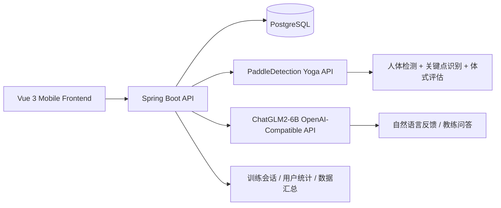

# YogaForge AI: Intelligent Yoga Coach System

<div align="center">

**面向移动端的智能瑜伽教练机器人系统，融合计算机视觉、大语言模型与后端服务，实现动作识别、质量评分、纠正建议与训练分析闭环。**


</div>

---

## ✨ 项目定位

本项目重点聚焦 **“瑜伽教练机器人系统”** 的整体设计与开发，核心目标是把 **人体姿态识别、动作评分、纠正建议、训练统计、自然语言交互** 串成一套可服务化、可联调、可扩展的智能训练系统。

系统围绕以下能力展开：

- **计算机视觉识别**：基于百度飞桨与 PaddleDetection，实现人体检测、关键点识别、体式评估与质量打分。
- **大语言模型增强**：基于 ChatGLM2-6B 构建在线接口，并结合微调能力提供更自然的训练反馈与交互解释。
- **后端服务架构**：基于 Spring Boot + PostgreSQL 组织业务接口、训练会话、数据汇总与跨服务调用。
- **移动端训练交互**：通过 Vue 3 前端承接摄像头采样、动作训练、结果展示与训练分析。
- **跨语言服务联调**：实现前端 TypeScript、后端 Java、模型服务 Python 的协同工作链路。

> 这是一个围绕“智能瑜伽训练”场景构建的多模块全栈系统，而不是单一的页面 Demo 或单模型脚本。

---

## 🚀 项目亮点

### 1. 面向真实训练场景的瑜伽教练系统
系统不是简单地“识别动作”，而是围绕用户训练流程构建：

- 打开摄像头
- 采集视频帧
- 检测人体与关键点
- 匹配体式模板
- 生成质量评分
- 输出中文纠正建议
- 汇总训练时长、卡路里与统计信息

### 2. 飞桨视觉能力服务化落地
项目基于 **PaddleDetection + TinyPose + PicoDet** 搭建姿态识别服务，并封装为统一 API，对移动端 / Java 后端透明提供：

- 基础关键点推理
- 瑜伽体式识别
- 动作质量评分
- 文本化纠正建议
- 骨架渲染结果输出

### 3. LLM 与视觉模块融合
除姿态识别外，系统还接入 **ChatGLM2-6B**，通过在线接口承接训练问答、教练式反馈、训练解释等自然语言能力，使系统从“识别器”升级为“可交流的教练”。

### 4. 完整后端业务支撑
Java 后端承担训练会话编排、数据落库、用户指标聚合、模型服务转发等职责，使整个系统具备：

- 可扩展的 API 架构
- 可维护的数据库模型
- 可拆分的服务边界
- 跨语言调用能力

### 5. 面向工程化迭代的系统拆分
当前仓库已经形成较清晰的服务边界：

- 前端交互层：Vue 3
- 业务 API 层：Spring Boot
- 视觉推理层：PaddleDetection / Flask
- 对话模型层：ChatGLM2-6B / FastAPI
- 数据存储层：PostgreSQL

这种结构天然适合后续继续向 **容器化部署、服务编排、并发优化、稳定性增强** 演进。

---

## 🧠 对齐岗位 / 项目介绍的核心表述

本项目可对应概括为：

- **负责瑜伽教练机器人系统的整体设计与开发**，融合计算机视觉、大语言模型与后端服务，基于百度飞桨实现瑜伽动作识别评分，向移动端输出纠正建议与训练分析；
- **完成飞桨模型 API 封装与服务化部署**，对 ChatGLM2-6B 进行在线接口适配，并保留 P-Tuning 微调能力与模型接入路径；
- **设计 PostgreSQL 数据结构并构建后端服务架构**，实现前端 TypeScript、后端 Java、模型服务 Python 的跨语言联调，支撑系统稳定运行与后续工程化扩展。

> 如果用于答辩、简历或 GitHub 展示，本仓库建议优先从“智能瑜伽教练系统”视角介绍，而不是从宠物陪伴玩法切入。

---

## 🏗️ 系统架构



### 训练闭环

```text
移动端打开训练页
  ↓
摄像头采集视频帧
  ↓
后端 / 视觉服务进行人体检测与姿态评估
  ↓
返回体式识别、质量评分、纠正建议
  ↓
训练结束后汇总时长 / 卡路里 / 统计数据
  ↓
用户查看训练分析，并可继续与 AI 教练对话
```

---

## 🧰 技术栈

| 层级 | 技术 |
|---|---|
| 前端 | Vue 3、TypeScript、Vite、Vue Router、Pinia、Axios、SCSS、Tailwind CSS、Naive UI |
| 后端 | Java 17、Spring Boot 3、Spring Security、Spring Data JPA、JWT、Lombok |
| 数据库 | PostgreSQL |
| 视觉 AI | PaddleDetection、PaddlePaddle、OpenCV、Flask |
| 大语言模型 | ChatGLM2-6B、FastAPI、OpenAI-Compatible API |
| 跨语言协同 | TypeScript + Java + Python |

---

## 📱 前端能力概览

前端位于 [frontend](./frontend)，承担移动端训练入口、数据展示与结果可视化。

### 重点页面

- `AuthPage`：登录 / 注册
- `WorkoutPage`：设备连接、摄像头预览、训练主流程、骨架覆盖层展示
- `DataPage`：今日训练数据、月历打卡总览、训练完成率
- `CaloriesDetailPage`：消耗卡路里详情
- `ExerciseDurationPage`：运动时长详情
- `ProfilePage`：用户画像与训练统计汇总

### 训练页已实现的关键能力

- 扫描并模拟连接训练设备
- 打开摄像头并定时采样视频帧
- 叠加姿态骨架层与训练结果
- 周期性向后端 / 模型服务发送识别请求
- 训练结束后上报时长与卡路里

### 前端工程特点

- 统一 Axios API 封装
- 自动注入 JWT Token
- 适配移动端风格页面结构
- 支持训练流程与统计流程联动

---

## 🔐 Spring Boot 后端能力

后端位于 [backend/backend/springboot-server](./backend/backend/springboot-server)。

它在系统中承担“**业务编排 + 数据汇总 + 跨服务转发**”的中枢角色。

### 已实现的核心职责

- 用户注册、登录、JWT 鉴权
- 当前用户资料查询与更新
- 今日训练数据与累计训练指标聚合
- 瑜伽训练会话的开始 / 帧处理 / 结束
- 手动训练指标记录
- 视觉模型服务调用封装
- 大语言模型服务调用封装
- PostgreSQL 持久化存储

### 典型接口

#### 认证与用户
- `POST /api/auth/register`
- `POST /api/auth/login`
- `GET /api/users/me`
- `PATCH /api/users/me`
- `GET /api/users/me/metrics`
- `GET /api/user/today-data`

#### 训练与指标
- `POST /api/yoga/session/start`
- `POST /api/yoga/session/frame`
- `POST /api/yoga/session/stop`
- `GET /api/yoga/session/metrics`
- `POST /api/yoga/session/metrics-manual`

#### 语言交互
- `POST /api/chat`

### 后端工程价值

- 把前端和模型服务解耦
- 统一管理认证、业务规则与数据结构
- 为跨语言服务联调提供稳定入口
- 为后续并发控制、失败重试、容器化编排保留清晰边界

---

## 🧍 视觉识别模块：PaddleDetection Yoga API

视觉模块位于 [backend/backend/PaddleDetection](./backend/backend/PaddleDetection)。

项目中最关键的自定义入口是：

- [backend/backend/PaddleDetection/app/yoga_api_server.py](./backend/backend/PaddleDetection/app/yoga_api_server.py)

### 已落地的视觉链路

- **人体检测**：基于 PicoDet 先定位画面中的人体目标
- **关键点识别**：基于 TinyPose 预测人体关键点
- **体式模板匹配**：通过角度特征与模板进行匹配评估
- **质量评分**：返回 `qualityScore`
- **中文纠正建议**：返回 `suggestions`
- **可视化渲染**：返回带骨架和提示的叠加图像

### 对外服务接口

- `POST /infer`：基础关键点推理
- `POST /pose/evaluate`：输出 `recognized`、`templatePose`、`qualityScore`、`suggestions`
- `POST /pose/render`：输出骨架叠加渲染图
- `GET /health`：健康检查

### 适合展示的工程表达

这一模块不是单纯跑通官方模型，而是完成了：

- 飞桨模型调用封装
- 训练场景 API 服务化
- 模板评估逻辑整合
- 纠正建议生成链路打通
- 面向前端可消费的数据结构设计

---

## 🤖 大模型模块：ChatGLM2-6B

大模型代码位于 [backend/backend/ChatGLM2-6B](./backend/backend/ChatGLM2-6B)。

项目中重点接入了：

- `openai_api.py`：将 ChatGLM2-6B 适配为 OpenAI 风格接口
- `ptuning/`：保留 P-Tuning v2 微调能力与相关脚本
- 本地模型目录 `models/chatglm2-6b`

### 在本系统中的作用

ChatGLM2-6B 不承担“动作识别”，而是承担 **训练解释与对话交互增强** 的角色：

- 用户可以围绕训练、动作、建议进行自然语言问答
- Java 后端通过统一接口调用模型服务
- 模型服务对外暴露标准化在线接口，便于前后端与其他服务复用

### 当前接入方式

- Java 后端调用 `/v1/chat/completions`
- 将前端输入封装为 OpenAI 风格 `messages`
- 模型返回文本结果后再由业务层包装给移动端

### 能体现的项目能力

- ChatGLM2-6B 在线接口开发
- OpenAI-Compatible API 适配
- P-Tuning 微调链路保留
- 与训练场景的业务级整合

---

## 🗄️ PostgreSQL 数据库设计

数据库配置与 Schema 位于：

- [backend/backend/springboot-server/src/main/resources/application.yml](./backend/backend/springboot-server/src/main/resources/application.yml)
- [backend/backend/springboot-server/src/main/resources/schema.sql](./backend/backend/springboot-server/src/main/resources/schema.sql)

### 当前已覆盖的核心数据表

- `users`：用户信息
- `exercise_sessions`：训练会话记录
- `user_metrics`：用户训练聚合指标
- `devices` / `device_sessions`：设备与连接记录
- 其余表用于扩展系统状态与会话管理

### 数据层价值

- 支撑训练记录持久化
- 支撑今日数据与累计指标分析
- 为后续训练报告、排行榜、用户画像等扩展提供基础
- 与 Spring Data JPA 形成稳定的实体映射关系

---

## 🔄 跨语言联调链路

本项目是典型的多语言协作架构：

- **TypeScript / Vue**：移动端训练交互与可视化
- **Java / Spring Boot**：业务 API、认证鉴权、数据管理、服务编排
- **Python / Flask / FastAPI**：视觉推理与大模型接口服务

### 联调流程

1. 前端采集图像 / 用户输入
2. Java 后端统一接收业务请求
3. Java 服务转发到 Python 视觉服务或 ChatGLM 服务
4. Python 返回结构化结果
5. Java 汇总后返回前端
6. PostgreSQL 存储训练数据与用户指标

这种拆分方式非常适合展示：

- 跨语言系统整合能力
- 服务边界设计能力
- 接口协议设计能力
- 模型能力工程化落地能力

---

## 📁 仓库结构

```text
yogaforge-ai/
├─ frontend/                                 # Vue 3 前端训练应用
│  ├─ src/
│  │  ├─ api/                                # Axios 请求封装
│  │  ├─ router/                             # 路由配置
│  │  ├─ stores/                             # 本地状态管理
│  │  ├─ views/                              # 页面视图
│  │  └─ components/                         # 通用组件
│
├─ backend/
│  └─ backend/
│     ├─ springboot-server/                  # Java 业务后端
│     ├─ PaddleDetection/                    # 飞桨视觉识别与 Yoga API
│     │  ├─ app/yoga_api_server.py           # 姿态识别服务入口
│     │  └─ Yoga-82/                         # Yoga-82 数据与训练脚本
│     └─ ChatGLM2-6B/                        # ChatGLM2-6B 与在线接口适配
│
└─ .env.example                              # 前端环境变量示例
```

---

## 🚀 快速启动

> 推荐按 **视觉服务 → 大模型服务 → Java 后端 → 前端** 的顺序启动，以便联调训练主链路。

### 1. 启动视觉识别服务

```bash
cd backend/backend/PaddleDetection
python app/yoga_api_server.py
```

默认监听：`http://localhost:5001`

### 2. 启动 ChatGLM2-6B 在线接口

```bash
cd backend/backend/ChatGLM2-6B
python openai_api.py
```

默认暴露：
- `GET /v1/models`
- `POST /v1/chat/completions`

### 3. 启动 Spring Boot 后端

```bash
cd backend/backend/springboot-server
mvn clean package
mvn spring-boot:run
```

### 4. 启动前端

```bash
cd frontend
npm install
npm run dev
```

---

## ⚙️ 运行环境建议

### 前端
- Node.js 18+
- npm / pnpm

### Java 后端
- Java 17
- Maven 3.9+
- PostgreSQL

### Python 模型服务
- Python 3.10+
- PaddlePaddle / OpenCV / Flask
- PyTorch / Transformers / FastAPI
- 若需高性能推理，建议使用 GPU 环境

---

## 📌 值得重点展示的实现点

### 视觉侧
- [backend/backend/PaddleDetection/app/yoga_api_server.py](./backend/backend/PaddleDetection/app/yoga_api_server.py)
- [backend/backend/PaddleDetection/Yoga-82/yoga82_dataset.py](./backend/backend/PaddleDetection/Yoga-82/yoga82_dataset.py)
- [backend/backend/PaddleDetection/Yoga-82/train_yoga82_classifier.py](./backend/backend/PaddleDetection/Yoga-82/train_yoga82_classifier.py)

### 后端侧
- [backend/backend/springboot-server/src/main/java/com/myfitpet/yoga/YogaController.java](./backend/backend/springboot-server/src/main/java/com/myfitpet/yoga/YogaController.java)
- [backend/backend/springboot-server/src/main/java/com/myfitpet/yoga/TodayStatsController.java](./backend/backend/springboot-server/src/main/java/com/myfitpet/yoga/TodayStatsController.java)
- [backend/backend/springboot-server/src/main/java/com/myfitpet/pose/PoseModelClient.java](./backend/backend/springboot-server/src/main/java/com/myfitpet/pose/PoseModelClient.java)
- [backend/backend/springboot-server/src/main/java/com/myfitpet/chat/ChatModelClient.java](./backend/backend/springboot-server/src/main/java/com/myfitpet/chat/ChatModelClient.java)

### 前端侧
- [frontend/src/views/WorkoutPage.vue](./frontend/src/views/WorkoutPage.vue)
- [frontend/src/views/DataPage.vue](./frontend/src/views/DataPage.vue)
- [frontend/src/views/ProfilePage.vue](./frontend/src/views/ProfilePage.vue)

### 大模型侧
- [backend/backend/ChatGLM2-6B/openai_api.py](./backend/backend/ChatGLM2-6B/openai_api.py)
- [backend/backend/ChatGLM2-6B/ptuning](./backend/backend/ChatGLM2-6B/ptuning)

---

## 🧩 工程化说明

从当前仓库可以明确看出，系统已经具备以下工程化特征：

- 模型能力与业务 API 解耦
- 前后端与 AI 服务独立部署
- PostgreSQL 持久化存储与 JPA 映射
- 统一的后端对外 API 入口
- 跨语言联调链路完整

### 关于容器化部署

当前仓库 **未直接提供项目级 Dockerfile / docker-compose 文件**，但服务结构已经按容器化部署思路拆分为：

- 前端容器
- Spring Boot API 容器
- PaddleDetection 视觉服务容器
- ChatGLM2-6B 模型服务容器
- PostgreSQL 数据库容器

因此在答辩、项目说明或后续工程扩展中，可以自然演进到容器化部署与服务编排。

### 关于并发与稳定性

当前代码已经完成跨服务调用封装与统一业务入口设计，适合进一步增强：

- 超时控制
- 失败重试
- 熔断降级
- 并发调度
- 模型服务负载拆分

这也正是该系统从“原型可用”走向“工程稳定”的关键方向。

---

## 🌱 后续优化方向

- 增加更多瑜伽体式模板与动作分类能力
- 引入更细粒度的训练报告与阶段分析
- 强化大模型对训练建议的个性化能力
- 增加后端重试机制、超时控制与异步化处理
- 补充 Dockerfile / compose 文件，完成完整容器化部署
- 引入模型缓存、队列或网关层，提升高并发稳定性

---

## ❤️ 总结

这个项目最值得展示的，不是某一个页面，而是它完成了以下事情：

- 把 **飞桨视觉识别** 做成可调用、可服务化的瑜伽评估接口
- 把 **ChatGLM2-6B** 接入成在线语言能力服务
- 用 **Spring Boot + PostgreSQL** 搭起稳定的业务骨架
- 用 **Vue 3 移动端前端** 承接训练流程与分析展示
- 打通 **TypeScript / Java / Python** 的跨语言联调链路

> 如果要用一句话概括：这是一个围绕“智能瑜伽教练机器人”场景完成端到端设计与开发的全栈 AI 系统。
